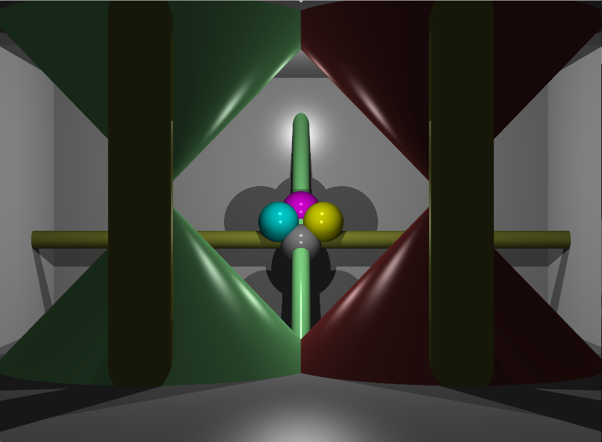
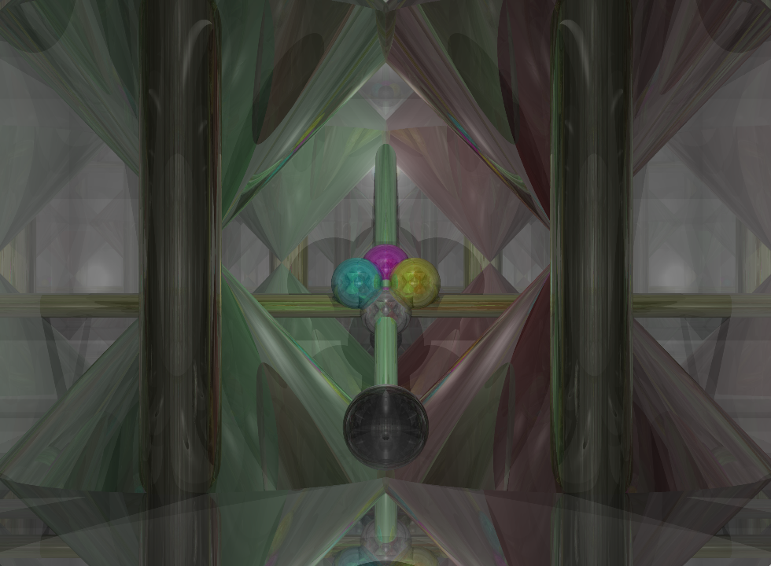
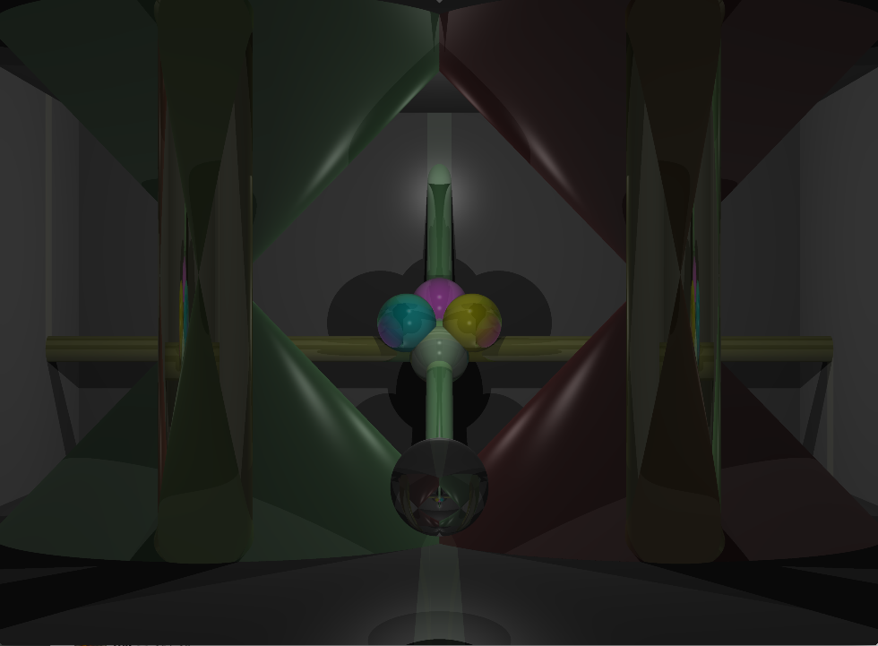
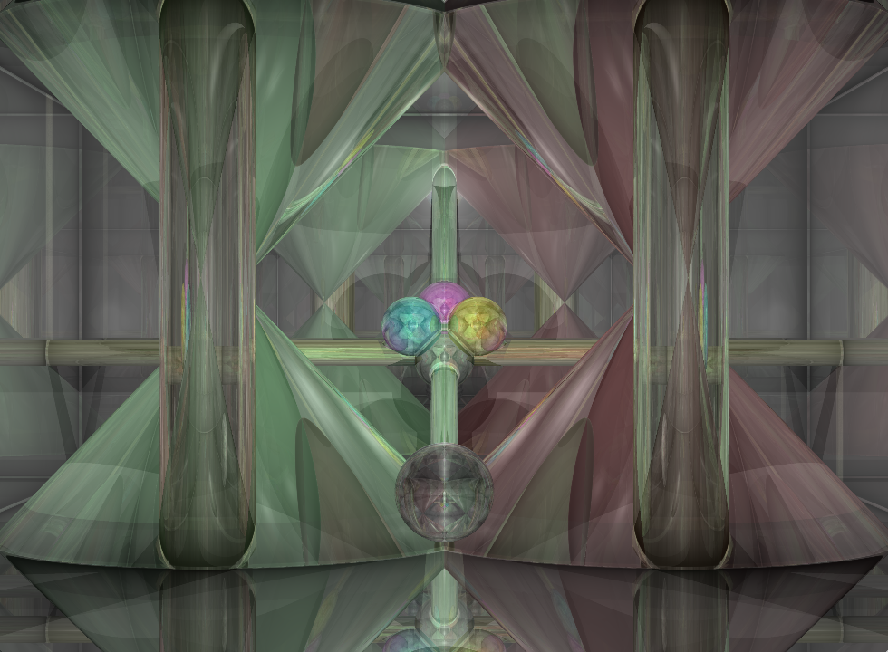

42-Raytracer
============

RT project at 42 school\
\
In computer graphics, ray tracing is a rendering technique for generating an image by tracing the path of light as pixels in an image plane and simulating the effects of its encounters with virtual objects. The technique is capable of producing a very high degree of visual realism, usually higher than that of typical scanline rendering methods, but at a greater computational cost. This makes ray tracing best suited for applications where taking a relatively long time to render a frame can be tolerated, such as in still images and film and television visual effects, and more poorly suited for real-time applications such as video games where speed is critical. Ray tracing is capable of simulating a wide variety of optical effects, such as reflection and refraction, scattering, and dispersion phenomena.

Requirements
------------

- MacOS
- SDL2

Features
--------

- ### Parser
	+ JSON (non-generic) [ ] (on going)

- ### Ray
	+ Rotation [X]
	+ Reflection [X]
	+ Refraction [X]
	+ Fresnel [X]

- ### Objects
	+ Sphere [X]
	+ Cone [X]
	+ Plane [X]
	+ Cylinder [X]
	+ Ellipse [ ]
	+ Torus [ ]
	+ Mobuus strip [ ]
	+ Limited object [ ]
	+ Composed object [ ]
	+ Negative object [ ]

- ### Light
	+ Phong Shading [X]
	+ Dazzling effect [ ]
	+ Parallel light [ ]

- ### Effect
	+ Anti-aliasing [X]
	+ Sepia filter [ ]
	+ Daltonism filter [ ]
	+ Fifty shade of grey [ ]
	+ Stereoscope [ ]

- ### Other option
	+ Camera movement [ ]
	+ Multi-threading [ ]
	+ Save rendering (.jpeg, .png ...) [ ]
	+ Clusterise [ ]
	+ Interface [ ]
	+ Live modification [ ]
	+ Caustic light / Global illumination [ ]

Few actual renderer
-------------------

#### Basic rendering with Phong Shading and aa5.

#### Rendering with reflection 7 rebounds and aa5

#### Rendering with refraction 7 rebounds and aa5

#### Rendering with fresnel 7 rebounds and aa5

